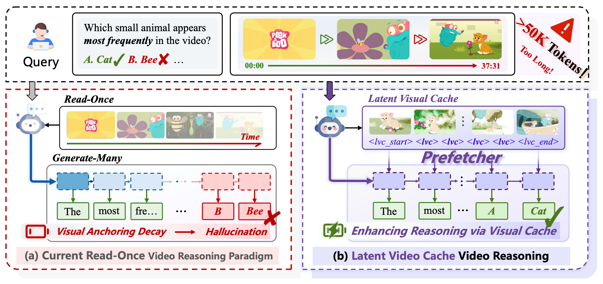
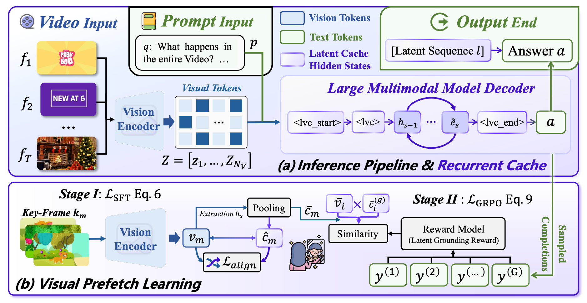
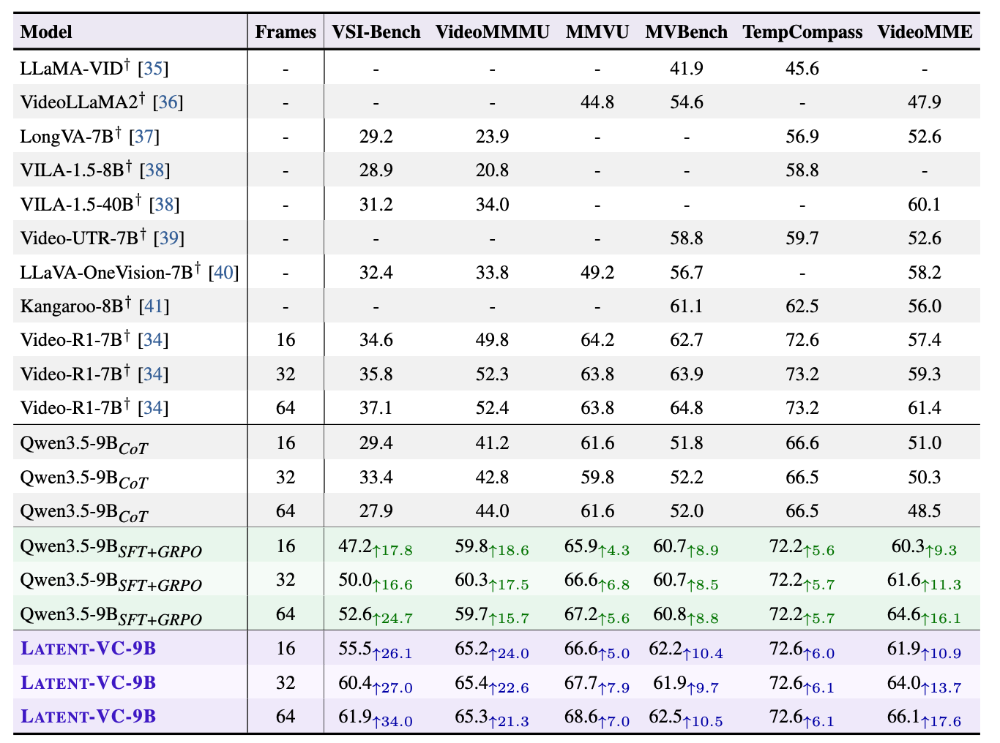

<h1 align="center">Latent Video Cache for Video Reasoning</h1>

<p align="center">
  
</p>

<p align="center">
  <a href="https://arxiv.org/pdf/2607.02607"></a>
  <a href="https://huggingface.co/BRZ911/Latent-VC-9B"></a>
  <a href="https://huggingface.co/datasets/BRZ911/Latent-VC-Data"></a>
</p>

This repository contains the official implementation of **Latent Video Cache (Latent-VC)** for grounded video reasoning.


## 🌟 Overview

**Latent-VC** introduces a recurrent latent visual cache inside the decoder of a large multimodal model to mitigate **Visual Anchoring Decay** in long-form video reasoning.


Instead of relying on a pure *read-once, generate-many* pipeline, Latent-VC constructs a compact latent visual memory before answer generation, enabling the model to preserve grounding to visual evidence throughout reasoning.


Our method is built on **Qwen3.5-9B-Base** and trained with two stages:

- **Stage I: Supervised Fine-Tuning (SFT)** with contrastive cache alignment.
- **Stage II: GRPO** with vision-grounded rewards and latent grounding supervision.

<p align="center">
  
</p>

## 📄 Paper

**Title:** `Latent Visual Cache for Video Reasoning`

### 📝 Abstract

Video reasoning requires Large Multimodal Models (LMMs) to remain grounded in dense visual evidence, yet existing systems largely follow a *read-once, generate-many* paradigm, where visual grounding weakens during generation. We identify this issue as **Visual Anchoring Decay** and propose **Latent Video Cache (Latent-VC)**, a recurrent latent visual cache inserted into the decoder to preserve compact visual memories throughout reasoning. Latent-VC is trained with supervised contrastive cache alignment and vision-grounded GRPO with a latent grounding reward, while maintaining strict train-inference alignment through native decoder hidden states. Built on Qwen3.5-9B, Latent-VC consistently outperforms strong CoT and SFT+GRPO baselines across six video benchmarks, especially on grounding-intensive and long-video tasks. It also achieves higher accuracy with substantially shorter responses, suggesting that latent visual caching improves video reasoning by preserving visual evidence rather than relying on longer textual chains.

## 🧠 Method

<p align="center">
  
</p>

Latent-VC contains two key components:

- **Inference pipeline with recurrent latent cache**: the model rolls out latent cache states before answer decoding.
- **Latent prefetch learning**:

  **1. SFT stage** aligns latent cache states with key visual moments.

  **2. GRPO stage** optimizes answer quality, format, temporal grounding, and latent grounding jointly.

## 📊 Experimental Results

<p align="center">
  
</p>

Latent-VC consistently improves over both CoT and SFT+GRPO baselines across six public video reasoning benchmarks.

## 📁 Repository Structure

```text
latent_code/
├── datasets/
├── material/
├── scripts/
├── src/
├── requirements.txt
└── README.md
```

## 🚀 Getting Started

### 1. ⬇️ Download the Base Model

Download **Qwen3.5-9B-Base** from Hugging Face:

- [Qwen/Qwen3.5-9B-Base](https://huggingface.co/Qwen/Qwen3.5-9B-Base)

Place the model under:

```bash
models/Qwen3.5-9B-Base
```

### 2. 📦 Download the Video Training Data

Download the video dataset from:

- [marinero4972/Open-o3-Video](https://huggingface.co/datasets/marinero4972/Open-o3-Video)

Place the raw video files under:

```bash
datasets/video_data
```

The training annotation files used by the scripts are already expected at:

```bash
datasets/lvc_sft.json
datasets/lvc_grpo.json
```

### 3. 🔧 Install the Environment

```bash
conda create -n videolvc python=3.11 -y
conda activate videolvc
pip install -r requirements.txt
```

## 🏋️ Training

### 📚 Stage 1: SFT

Run supervised fine-tuning with latent cache alignment:

```bash
bash scripts/train_sft.sh
```

This script uses the following default paths:

- Base model: `models/Qwen3.5-9B-Base`
- Training data: `datasets/lvc_sft.json`
- Output checkpoint: `checkpoints/video_lvc_sft_all_image/`

### 🎯 Stage 2: GRPO

Run GRPO training starting from the Stage 1 checkpoint:

```bash
bash scripts/train_grpo.sh
```

This script uses the following default paths:

- Base model: `models/Qwen3.5-9B-Base`
- SFT checkpoint: `checkpoints/video_lvc_sft_all_image/checkpoint-1200`
- Training data: `datasets/lvc_grpo.json`
- Output checkpoint: `checkpoints/video_lvc_grpo/`

## 🧪 Evaluation

### 1. 📥 Download Evaluation Data

Download the evaluation set from:

- [Video-R1/Video-R1-eval](https://huggingface.co/datasets/Video-R1/Video-R1-eval)

Place the evaluation files under:

```bash
datasets
```

### 2. ▶️ Run Evaluation

```bash
bash scripts/eval_all_benchmarks.sh
```

By default, the evaluation script uses:

- Eval directory: `src/r1-v/Evaluation`
- Output directory: `eval_results_final`

You can also evaluate specific checkpoints by overriding environment variables, for example:

#### 🔍 Evaluate the SFT checkpoint

```bash
MODEL_TYPE=sft MODEL_PATH=checkpoints/video_lvc_sft_all_image/checkpoint-1200 bash scripts/eval_all_benchmarks.sh
```

#### 🔍 Evaluate the GRPO checkpoint

```bash
MODEL_TYPE=grpo MODEL_PATH=checkpoints/video_lvc_grpo/checkpoint-800 bash scripts/eval_all_benchmarks.sh
```

## 📚 Citation
Please create Github issues here or email [Yongheng Zhang](mailto:zyhbrz@gmail.com) if you have any questions or suggestions.
If you find this work useful, please cite:

```bibtex
@misc{zhang2026latentvisualcachevideo,
      title={Latent Visual Cache for Video Reasoning}, 
      author={Yongheng Zhang and Zhipeng Xu and Hao Wu and Yinghui Li and Di Yin and Xing Sun and Philip S. Yu},
      year={2026},
      eprint={2607.02607},
      archivePrefix={arXiv},
      primaryClass={cs.CV},
      url={https://arxiv.org/abs/2607.02607}, 
}
```
